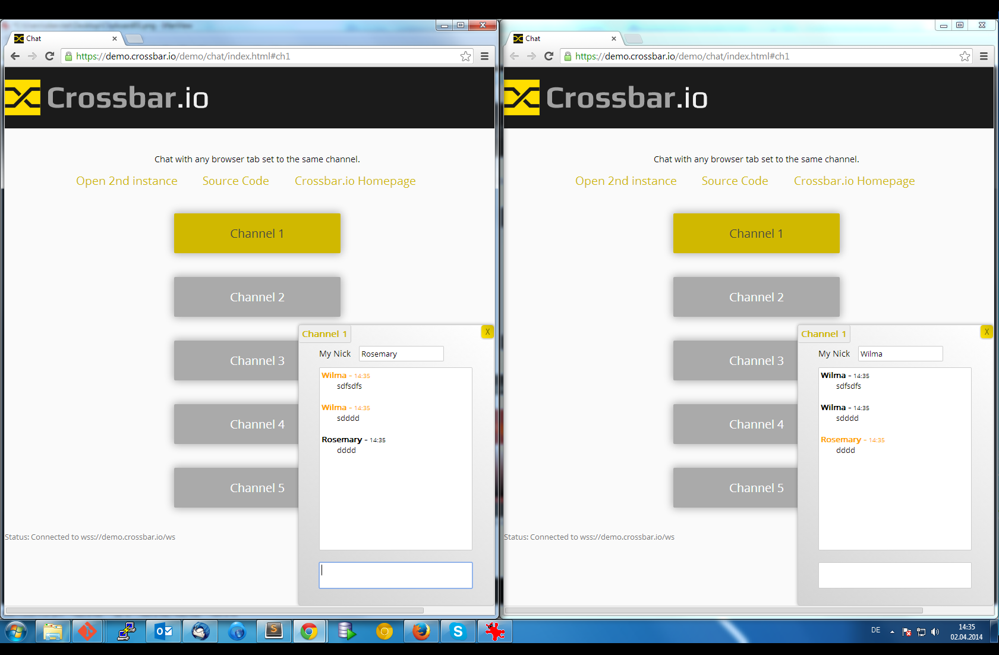

# Crossbar.io Demos

**Crossbar.io** comes with over a *dozen ready-to-run demos* that show off different features of [Crossbar.io](http://crossbar.io/) - the multi-protocol application router.

The complete demo bundle is available as a [Python package](https://pypi.python.org/pypi/crossbardemo) which you can install into your existing **Crossbar.io** installation (see below).

The source-code for the demos can be found in the repository [here](https://github.com/crossbario/crossbardemo/web) and is [open-source licensed](https://github.com/crossbario/crossbardemo/blob/master/LICENSE) under the Apache 2.0 license. This allows you to *reuse the code even in commercial projects* for use as starting points in your development.

## Get it

1. **Install**

To install from [PyPI](https://pypi.python.org/pypi/crossbardemo)

```shell
pip install crossbardemo
```

To upgrade an existing package from PyPI
	
```shell
pip install --upgrade crossbardemo
```

2. **Create** a new **Crossbar**.io node

```shell
cd $HOME
mkdir demo1
cd demo1
crossbar init --template demos
```

and start

```shell
cd $HOME/test1
crossbar start
```

3. **Open** demos at `http://127.0.0.1:8080` in your browser.


For example, open the "Chat" demos in two browser tabs to see it communicate in real-time



